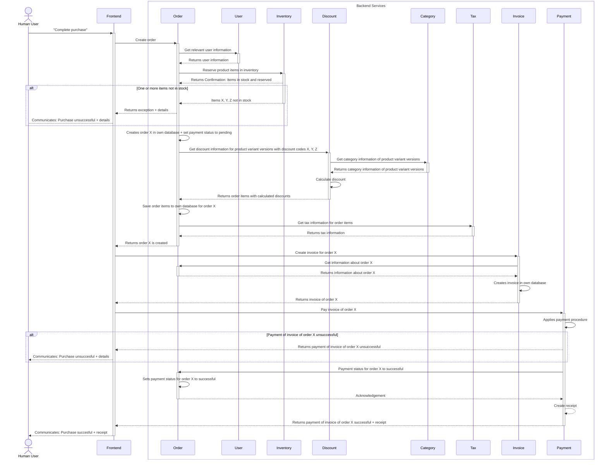

import CustomImage from "@site/src/components/CustomImage";

# Services and their Interaction

Our services are built based on the domain models bounded contexts.

## Domain-specific services and their dependencies

This diagram depicts the mandatory and optional service dependencies, resulting in upstream and downstream connections defining service interaction. An upstream service call the API of a downstream service.
Mandatory dependencies are marked with solid-line connections and optional dependencies with dotted-line connections.

Mandatory connections imply that a specific service requires mandatory services to its functionality. Optional connections imply that a specific service can service its functionality without its optional dependencies.

The diagram does not include non-domain services such as the API-gateway.

<CustomImage path="/images/webshop-dependencies-bounded-contexts" width="2803" height="2341" />

## Submitting a purchase

This is a sequence diagram modelling the interaction between services when a purchase is submitted. The process consists of several steps reserving product items, calculating tax and discounts and creating necessary artifacts as invoice and receipt. The interaction is part of the "buy" business process and leaves out shipping for readability reasons.

