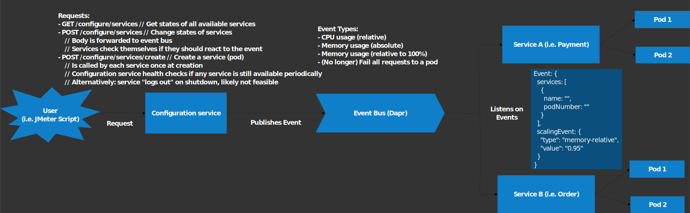

import CustomImage from "@site/src/components/CustomImage";

# Experiment configuration

MisArch is intended as a microservice reference architecture.
As such, it is possible to deterministically require certain conditions, i.e. a specific memory usage per pod.
The problem is here that every service can be deployed \<x\> times simultaenously in the form of replicas.
As such, the architecture to achieve this cannot be as simple as offering an endpoint to configure these limits on each service.

Here's how we solved this problem:

## Action sequence

<CustomImage
 path="/images/experiment-configuration-sequence-diagram"
 alt="sequence diagram how the experiment configuration works"
 width="806px"
 height="421px"
/>

As you can see in the diagram, most things are done automatically.
Most notably, every pod queries the configurator for its pod ID to listen to when it starts, and each pods subscribes to events from the configurator.
This is needed as Kubernetes pods do not know that they are pods and have no idea of knowing it unless specifically told.
Similarly, the configurator regularly healthchecks each pod, and if the health check fails, the pod is pruned.
If a pruned pod fails more than \<x\> <!-- TODO: 3? --> successive health checks, it will be removed from the configurator and be assumed to have died.

There are only two tasks left for the user to do:

1. Query the currently known services and pods
2. Based on this query, send a command to the configurator to adapt the services with the given service name (and pod number, if given). The service name of any pod is constant and set at compile time, so you will typically have a good guess how it is called if you lowercase the name and replace all spaces with `-`.

## Adaptation architecture

As soon as the user send the command to update the state of something, the configurator publishes the command as an event on the event bus, and as every pod is subscribed to such events, it will receive the payload and decide itself whether it needs to act.

If the system scales due to your command, you are responsible yourself to manage the new pods.
The configurator simply forwards your events to the required pods and does not handle any other state.
