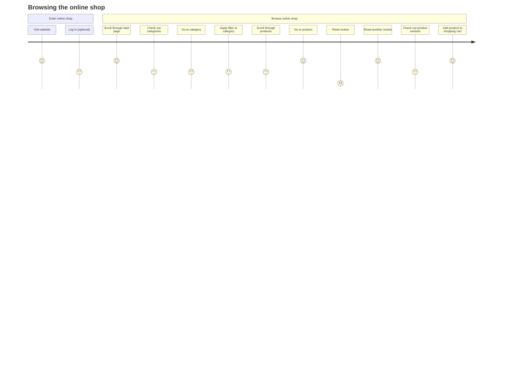
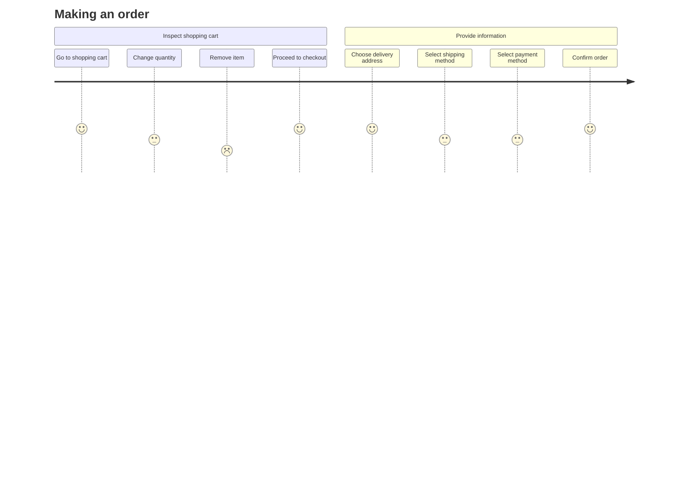
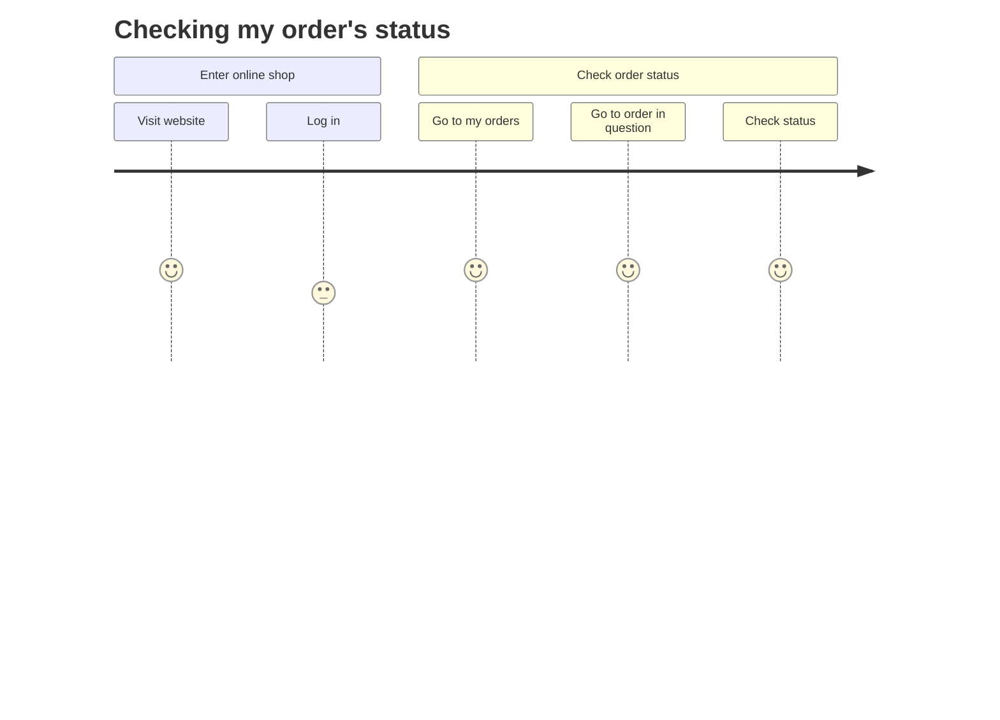
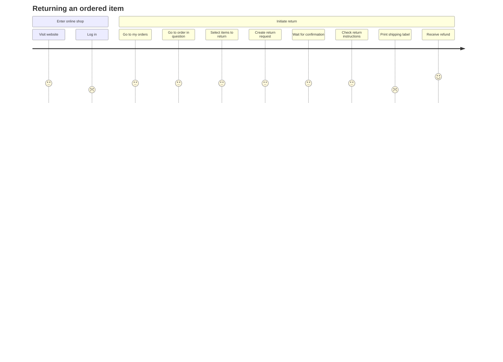
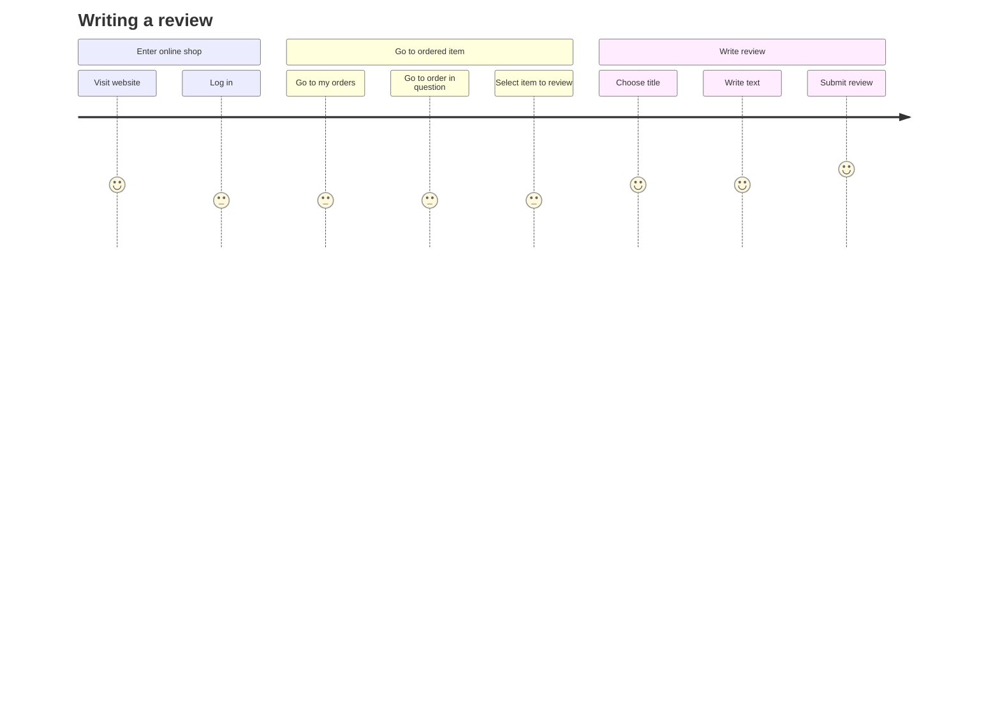
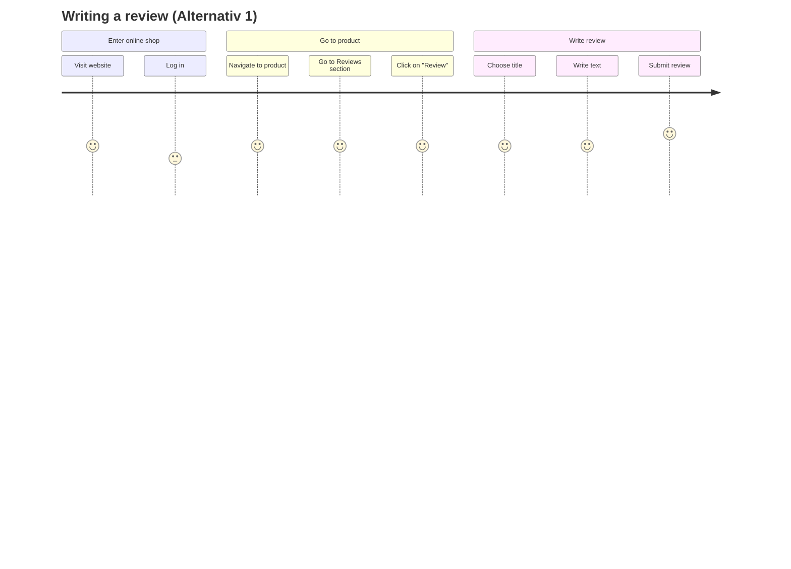
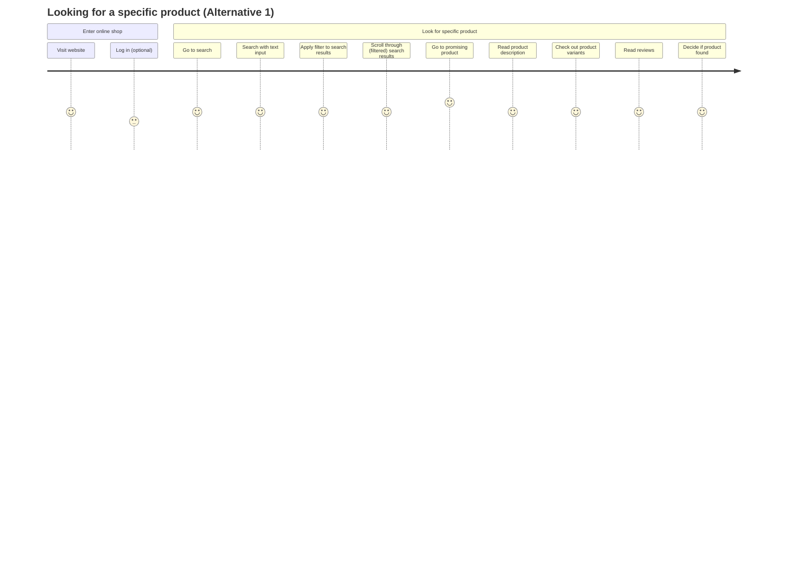
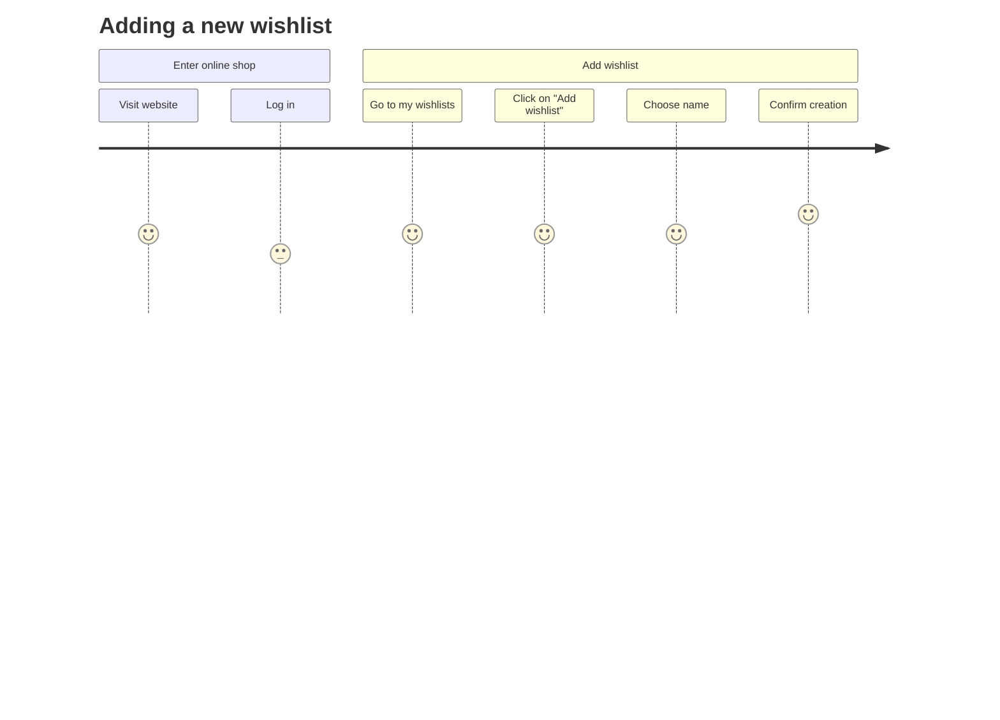
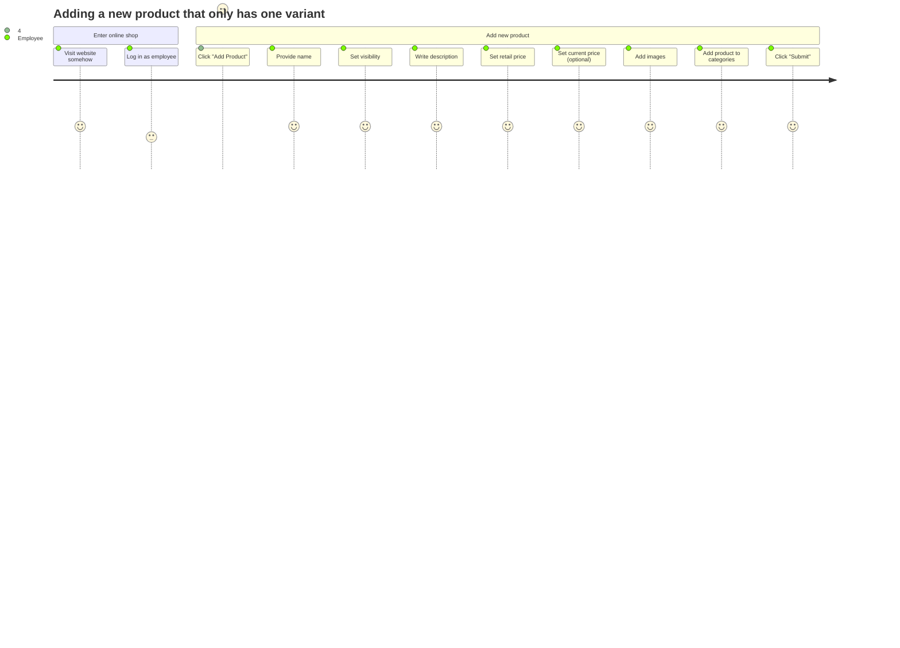
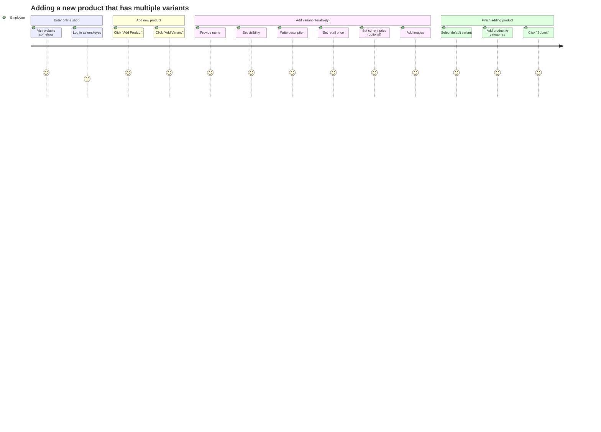

# User Journeys

As things stand, "user" refers to a normal visitor of the online shop who may buy something. User journeys for the administrator and the employee of the online shop will follow in the near future.

Note, that this list of user journeys is not complete when considering all of the requirements and the domain model.

## Browsing the online shop

## Making an order

## Checking my order's status

## Returning an ordered item

## Writing a review

## Writing a review (Alternativ 1)

## Looking for a specific product

## Looking for a specific product (Alternative 1)

## Adding a new wishlist

## Adding an item to the wishlist

## Adding a new product that only has one variant

## Adding a new product that has multiple variants

### Remarks

- The section "Add variant (iteratively)" can be repeated _n_ times depending on how many variants should be added.
- It might be that the user (Employee) can also put the various variants in a specific order.
